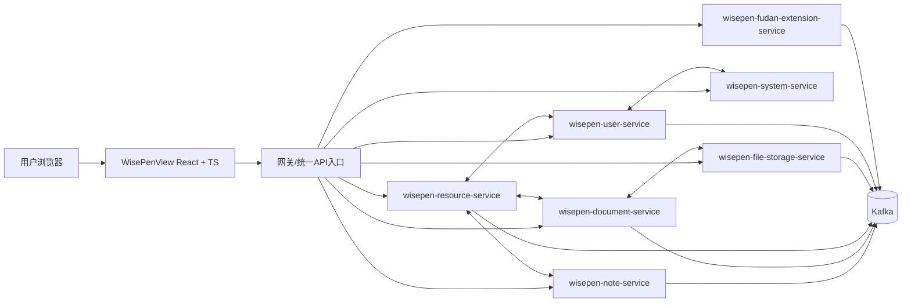

# WisePen 项目前后端架构与类职责说明

> 生成依据：当前仓库 `WisePenCloud`（后端）与 `WisePenView`（前端）源码。  
> 按你的要求，**配置类/常量类/type 声明/mock/test 等架构价值较低文件不做逐一解释**；其余按“类/模块”解释职责。

---

## 1. 总体架构

### 1.1 系统分层（概览）

### 1.2 前端运行主链路

`main.tsx` → `App.tsx`（Provider/主题/全局鉴权同步）→ `router.tsx`（路由分区）→ `layouts/*`（壳层）→ `views/*`（页面）→ `components/*`（业务组件）→ `services/*`（API 调用）→ 后端服务。

### 1.3 后端运行主链路

Controller（REST）→ Service（业务规则）→ Repository/Mapper（Mongo/MyBatis 持久化）→ Event/MQ（跨服务异步协同）；  
公共能力由 `wisepen-common` 与 `wisepen-common-log` 提供（鉴权切面、异常、通用返回体、日志切面等）。

---

## 2. 后端类职责（WisePenCloud）

## 2.1 公共基础层（common/common-log）

### core/安全/灰度/日志
- `R`：统一 API 返回包装（code/msg/data）。
- `PageResult`：统一分页结果模型。
- `ServiceException`：业务异常基类。
- `IErrorCode`：错误码接口约定。
- `GlobalExceptionHandler`：全局异常转响应。
- `SecurityContextHolder`：当前登录用户/组角色上下文获取。
- `GrayContextHolder`：灰度路由上下文。
- `SecurityAspect`：`@CheckLogin/@CheckRole` 的鉴权切面实现。
- `CheckLogin`：登录校验注解。
- `CheckRole`：角色校验注解。
- `PermissionException`：权限异常。
- `HeaderInterceptor`：请求头拦截与上下文传递。
- `FeignRequestInterceptor`：Feign 下游调用透传上下文头。
- `GrayServiceInstanceListSupplier`：灰度实例选择器。
- `GrayLoadBalancerConfiguration`：灰度负载配置。
- `DeveloperIsolationAutoConfiguration`：开发者隔离自动配置。
- `Log`：操作日志注解。
- `LogAspect`：日志注解切面，采集操作行为。
- `AsyncLogService`：异步日志落库/投递服务。

---

## 2.2 用户域（wisepen-user-service）

### 启动与核心业务
- `UserApplication`：用户服务启动入口。
- `AuthController`：登录/登出/注册/重置密码入口。
- `UserController`：用户资料相关接口。
- `AdminUserController`：管理员用户管理接口。
- `GroupController`：小组生命周期管理接口。
- `GroupMemberController`：组成员增删改查与权限调整。
- `WalletController`：钱包余额、交易、转账、兑换接口。
- `InternalController`：内部/跨服务用户能力接口。

### Service
- `AuthService`：认证会话核心逻辑（session 生成、登出失效）。
- `IUserService` / `UserServiceImpl`：用户资料、注册、重置密码业务。
- `IGroupService` / `GroupServiceImpl`：小组聚合业务。
- `IGroupMemberService` / `GroupMemberServiceImpl`：组成员关系业务。
- `IWalletService` / `WalletServiceImpl`：积分/代币账务处理。

### 策略、消费、缓存、DAO
- `UserVerificationStrategy`：用户身份验证策略接口。
- `VerificationStrategyFactory`：按模式选择验证策略。
- `EmailVerificationStrategy`：邮箱验证策略。
- `FudanUISVerificationStrategy`：复旦 UIS 验证策略。
- `TokenConsumptionConsumer`：消费代币扣减事件。
- `RedisCacheManager`：用户域缓存封装。
- `UserMapper` / `UserProfileMapper` / `UserWalletsMapper`：用户/资料/钱包 Mapper。
- `GroupMapper` / `GroupMemberMapper`：小组与成员 Mapper。
- `TokenVoucherMapper` / `TokenTransactionRecordMapper`：券与交易流水 Mapper。

### 实体/事件/校验
- `UserEntity`：用户主表实体。
- `UserProfileEntity`：用户资料实体。
- `UserWalletEntity`：钱包实体。
- `GroupEntity`：小组实体。
- `GroupMemberEntity`：组成员关系实体。
- `TokenVoucherEntity`：兑换券实体。
- `TokenTransactionRecordEntity`：交易流水实体。
- `GroupTokenConsumeEvent`：小组代币消费领域事件。
- `ValidUsername` / `ValidUsernameValidator`：用户名格式注解与校验器。

### API 合同（跨服务）
- `RemoteUserService`：用户服务 Feign 对外接口。
- `VerificationResultDTO`：统一验证结果 DTO。
- `TokenConsumptionMessage`：代币消费 MQ 消息体。
- `UserDisplayBase/UserInfoBase/UserProfileBase`：用户基础展示/信息模型。
- `GroupDisplayBase/GroupIdentityBase/GroupInfoBase/GroupMemberBase`：小组基础模型。
- `TokenTransactionRecordBase`：交易基础模型。
- `GroupDetailInfoResponse/GroupItemInfoResponse/GroupMemberDetailResponse/GroupMemberTokenDetailResponse`：小组查询返回体。
- `UserDetailInfoResponse/WalletDetailResponse/WalletTransactionRecordResponse`：用户与钱包返回体。
- `AuthLoginRequest/AuthRegisterRequest/AuthPwdResetRequest/AuthPwdResetVerifyRequest/AuthPwdAdminResetRequest`：认证请求体。
- `GroupCreateRequest/GroupDeleteRequest/GroupUpdateRequest`：小组请求体。
- `GroupMemberJoinRequest/GroupMemberQuitRequest/GroupMemberKickRequest/GroupMemberRoleUpdateRequest/GroupMemberTokenLimitUpdateRequest`：成员管理请求体。
- `UserInfoUpdateRequest/UserInfoAdminUpdateRequest/UserProfileUpdateRequest/UserProfileAdminUpdateRequest`：资料更新请求体。
- `WalletRedeemVoucherRequest/WalletTransferTokenRequest`：钱包请求体。
- `VoucherStatus/UserVerificationMode/TokenTransferType/TokenTransactionType/TokenPayerType/Status/ModelType/GroupRoleFilter/GenderType/DegreeLevel`：用户域枚举。

---

## 2.3 资源域（wisepen-resource-service）

### 启动/控制层
- `ResPermissionApplication`：资源权限服务启动入口。
- `ResourceItemController`：资源增删改查、列表查询主入口。
- `ResourceTagController`：标签树与标签操作接口。
- `GroupResConfigController`：组资源配置接口。
- `InternalResourceItemController`：内部资源接口。

### Service
- `IResourceService` / `ResourceServiceImpl`：资源聚合核心（标签、ACL、列表）。
- `ITagService` / `TagServiceImpl`：标签树管理、回收站逻辑。
- `IGroupResService` / `GroupResServiceImpl`：组级资源配置与组织规则。

### Repository/MQ/Event/任务
- `ResourceItemRepository`：资源主仓储。
- `TagRepository`：标签仓储。
- `GroupResConfigRepository`：组配置仓储。
- `CustomResourceItemRepository`：复杂筛选（权限+标签+排序）查询仓储。
- `IEventPublisher` / `KafkaEventPublisherImpl`：资源域事件发布。
- `AclRecalculateConsumer`：ACL 重算消费者。
- `TagChangedEvent/TagDeletedEvent/TagTrashedEvent`：标签变化领域事件。
- `ResourceGcTask`：资源回收清理任务。

### 领域模型/API 合同
- `ResourceItemEntity`：资源文档实体。
- `TagEntity`：标签实体。
- `GroupResConfigEntity`：组资源配置实体。
- `GroupTagBind`：资源与组标签绑定关系。
- `ComputedGroupAcl`：计算后的组 ACL 数据模型。
- `RemoteResourceService`：资源服务 Feign 对外接口。
- `AclRecalculateMessage/ResourceDeletedMessage`：资源域 MQ 消息体。
- `ResourceItemInfoBase/TagInfoBase/TagSpaceBase`：资源基础模型。
- `ResourceCreateReqDTO/ResourceInfoGetReqDTO/ResourceUpdateReqDTO`：资源通用请求体。
- `ResourceCheckPermissionReqDTO/ResourceCheckPermissionResDTO`：资源权限校验入参/出参。
- `ResourceRenameRequest/ResourceUpdateTagsRequest/ResourceUpdateActionPermissionRequest`：资源修改请求体。
- `TagCreateRequest/TagUpdateRequest/TagMoveRequest/TagDeleteRequest`：标签修改请求体。
- `GroupResConfigUpdateRequest`：组配置更新请求体。
- `ResourceItemResponse/TagTreeResponse/GroupResConfigResponse`：资源域返回体。
- `ResourceType/ResourceSortBy/ResourceAction/ResourceAccessRole/FileOrganizationLogic/AclGrantMode`：资源域业务枚举。

---

## 2.4 笔记域（wisepen-note-service）

### 启动/控制层
- `NoteApplication`：笔记服务启动入口。
- `NoteController`：笔记创建、详情、历史版本入口。
- `OpLogController`：操作日志接口。
- `InternalNoteController`：内部笔记接口。

### Service/Repository
- `INoteService` / `NoteServiceImpl`：笔记主业务（创建、读写协同）。
- `INoteVersionService` / `NoteVersionServiceImpl`：版本快照业务。
- `INoteOperationLogService` / `NoteOperationLogServiceImpl`：操作日志业务。
- `NoteDocumentRepository`：笔记正文仓储。
- `NoteVersionRepository`：版本仓储。
- `NoteOperationLogRepository`：操作日志仓储。

### Consumer/Entity/API
- `NoteSnapshotConsumer`：消费快照事件写入笔记正文。
- `NoteOperationLogConsumer`：消费操作日志事件。
- `ResourceDeletedConsumer`：资源删除后笔记清理。
- `NoteInfoEntity/NoteVersionEntity/NoteOperationLogEntity`：笔记实体。
- `RemoteNoteService`：笔记服务 Feign 对外接口。
- `NoteSnapshotMessage/NoteOperationLogMessage`：笔记 MQ 消息体。
- `NoteInfoBase/NoteVersionBase/NoteOperationLogBase`：基础模型。
- `NoteCreateRequest/NoteVersionQueryRequest`：请求体。
- `NoteInfoResponse/NoteVersionListResponse/NoteSnapshotResponse/NoteOperationLogResponse`：返回体。
- `VersionType`：版本类型枚举。

---

## 2.5 文档域（wisepen-document-service）

### 启动/控制层
- `DocumentApplication`：文档服务启动入口。
- `DocumentController`：上传初始化、状态同步、预览、详情接口。
- `InternalDocumentController`：内部文档接口。

### Service/Repository
- `IDocumentService` / `DocumentServiceImpl`：文档生命周期业务。
- `IDocumentFileService` / `DocumentFileServiceImpl`：文档文件处理。
- `IDocumentPreviewService` / `DocumentPreviewServiceImpl`：PDF 预览与 Range 处理。
- `DocumentInfoRepository/DocumentContentRepository/DocumentPdfMetaRepository`：文档存储仓储。

### Consumer/MQ/Util/Entity/API
- `FileUploadedConsumer`：文件上传完成后触发文档流程。
- `DocumentConversionAndParseConsumer`：文档转换与解析消费。
- `ResourceDeletedConsumer`：资源删除联动文档清理。
- `KafkaDocumentEventPublisher`：文档域事件发布。
- `DocumentGcTask`：文档垃圾回收任务。
- `PdfContentStreamBuilder`：PDF 内容流拼装。
- `MicroDotCodec`：微点编码工具。
- `WatermarkPreProcessor/WatermarkAppendixBuilder`：水印处理工具。
- `DocumentInfoEntity/DocumentContentEntity/DocumentPdfMetaEntity`：文档实体。
- `DocumentStatus`：文档状态基础模型。
- `DocumentUploadMeta`：上传元数据基础模型。
- `DocumentInfoBase/DocumentInfoResponse`：文档信息模型与返回体。
- `DocumentUploadInitRequest/DocumentUploadInitResponse`：上传初始化入参与返回。
- `DocumentParseTaskMessage/DocumentReadyMessage`：文档域 MQ 消息体。
- `DocumentStatusEnum`：文档状态枚举。

---

## 2.6 文件存储域（wisepen-file-storage-service）

### 启动/控制层
- `FileStorageApplication`：文件存储服务启动入口。
- `StorageController`：图片代理上传接口。
- `InternalStorageController`：内部存储接口。
- `ExternalStorageController`：外部可访问存储接口。

### Service/Strategy/Mapper
- `IStorageService` / `StorageServiceImpl`：存储服务主逻辑（上传、记录、状态）。
- `StorageProvider`：存储提供者接口抽象。
- `StorageManager`：按 provider 路由存储实现。
- `AliyunOssProvider`：阿里云 OSS 存储实现。
- `StorageRecordMapper/StorageConfigMapper`：存储记录与配置 Mapper。

### Consumer/MQ/Entity/API
- `FileDeleteConsumer`：文件删除消息消费。
- `KafkaStorageEventPublisher`：文件存储域事件发布。
- `StorageRecordEntity/StorageConfigEntity`：存储实体。
- `RemoteStorageService`：存储服务 Feign 接口。
- `FileUploadedMessage`：文件上传完成消息体。
- `StorageRecordBase/UploadUrlBase`：存储基础模型。
- `StorageRecordDTO/StsTokenDTO/UploadInitReqDTO/UploadInitRespDTO`：存储 DTO。
- `StorageProviderEnum/StorageSceneEnum/StorageStatusEnum`：存储枚举。

---

## 2.7 系统域（wisepen-system-service）

- `SystemApplication`：系统服务启动入口。
- `MailController`：邮件发送接口。
- `RemoteLogController`：远程日志上报接口。
- `UserFeedbackController`：用户反馈接口。
- `SysMailService/SysMailServiceImpl`：邮件服务。
- `SysOperLogService/SysOperLogServiceImpl`：操作日志服务。
- `FeedbackService/FeedbackServiceImpl`：反馈业务服务。
- `SysOperLogMapper/FeedbackMapper`：系统域 Mapper。
- `SysOperLogEntity/FeedbackEntity`：系统域实体。
- `RemoteMailService/RemoteLogService`：系统域 Feign 接口。
- `MailSendDTO/SysOperLogDTO/FeedbackRequest`：系统域 DTO。
- `FeedbackType/FeedbackStatus`：反馈业务枚举。

---

## 2.8 复旦扩展域（wisepen-fudan-extension-service）

- `FudanExtensionApplication`：扩展服务启动入口。
- `UISTaskController`：UIS 任务查询/控制接口。
- `UISAuthRequestConsumer`：消费 UIS 鉴权请求。
- `RedisCacheManager`：扩展域缓存管理。
- `RemoteFudanExtensionService`：扩展域 Feign 接口。
- `FudanUISTaskResultDTO`：UIS 任务结果模型。
- `FudanUISAuthRequestMessage`：UIS 鉴权消息体。
- `FudanUISTaskState`：UIS 任务状态枚举。

---

## 3. 前端模块职责（WisePenView）

> 说明：前端主要是函数组件与函数模块，不是 Java 风格 class。以下按“模块/组件”逐一解释。

## 3.1 启动与路由壳层

- `main.tsx`：React 根节点挂载入口。
- `App.tsx`：全局 Provider 装配（ServicesContext、Antd、Router、鉴权同步）。
- `router.tsx`：路由表定义与懒加载分包。
- `layouts/SystemLayout.tsx`：系统内页主壳（侧栏+主内容+聊天区）。
- `layouts/HomeLayout.tsx`：门户页壳层。
- `layouts/AuthLayout.tsx`：登录注册等认证页壳层。

## 3.2 页面层（views）

- `views/home/index.tsx`：落地页。
- `views/auth/Login/index.tsx`：登录页。
- `views/auth/Register/index.tsx`：注册页。
- `views/auth/ResetPassword/index.tsx`：找回密码页。
- `views/auth/NewPassword/index.tsx`：设置新密码页。
- `views/auth/VerifyEmail/index.tsx`：邮箱验证页。
- `views/drive/Drive/index.tsx`：云盘主页面（树视图/平铺/上传队列切换）。
- `views/drive/Drive/UploadDocumentModal.tsx`：文档上传弹窗页面级封装。
- `views/group/MyGroup/index.tsx`：我的小组页。
- `views/group/GroupDetail/index.tsx`：小组详情页。
- `views/note/index.tsx`：笔记编辑页。
- `views/pdf/PdfPreview/index.tsx`：PDF 预览页。
- `views/profile/Account/index.tsx`：账号资料页。
- `views/profile/Usage/index.tsx`：配额/使用情况页。
- `views/error/ResourceNotFound/index.tsx`：404 资源不存在页。
- `views/error/AppError/index.tsx`：全局错误页。

## 3.3 服务上下文与依赖注入（contexts）

- `ServicesContext/context.ts`：React Context 定义。
- `ServicesContext/registry.types.ts`：服务注册类型定义。
- `ServicesContext/registry.impl.ts`：真实服务实例装配（分层依赖注入）。
- `ServicesContext/registry.mock.ts`：mock 服务装配。
- `ServicesContext/registry.ts`：环境选择 registry 导出。
- `ServicesContext/ServicesProvider.tsx`：服务 Context Provider。
- `ServicesContext/hooks.ts`：`useXxxService` 钩子导出。
- `ServicesContext/index.ts`：统一导出入口。

## 3.4 API 服务层（services）

### 核心服务实现
- `Auth/AuthServices.impl.ts`：认证 API（登录/注册/登出/重置）。
- `User/UserServices.impl.ts`：用户信息 API。
- `Group/GroupServices.impl.ts`：小组 API。
- `Wallet/WalletServices.impl.ts`：钱包与代币 API。
- `Quota/QuotaServices.impl.ts`：配额 API。
- `Resource/ResourceServices.impl.ts`：资源列表/重命名/移动/标签更新 API。
- `Tag/TagServices.impl.ts`：标签树 API。
- `Sticker/StickerServices.impl.ts`：标签模板（sticker）API。
- `Folder/FolderServices.impl.ts`：文件夹组织与目录加载 API。
- `Document/DocumentServices.impl.ts`：文档上传与状态 API。
- `Note/NoteServices.impl.ts`：笔记信息/版本 API。
- `Chat/ChatServices.impl.ts`：会话列表、历史消息、模型列表 API。
- `Image/ImageServices.impl.ts`：图片上传 API。

### 映射/注册辅助
- `Group/groupMember.mapper.ts`：组成员后端模型映射。
- `Chat/model.mapper.ts`：模型列表映射。
- `cacheRegistry.ts`：各服务缓存清理注册中心。
- `*/index.ts`：服务聚合导出。
- `*/index.type.ts`：服务类型契约（保留，不逐条解释）。

## 3.5 会话协同层（session）

- `session/chat/useChatSession.ts`：基于 `@ai-sdk/react` 的聊天会话封装（流式发送、states 注入）。
- `session/note/useNoteSession.ts`：笔记协同会话封装（Yjs + IndexedDB + Provider 生命周期）。
- `session/note/WisepenProvider.ts`：笔记协同 provider 实现/封装。
- `session/note/NoteStatusObserver.ts`：笔记连接状态观察器。

## 3.6 全局状态（store/zustand）

- `useDrivePreferencesStore.ts`：云盘视图偏好（folder/flat/uploadQueue）。
- `useCurrentChatSessionStore.ts`：当前会话 id/title 状态。
- `useNewChatSessionStore.ts`：新建会话中间态。
- `useChatPanelStore.ts`：聊天面板展开/收起状态。
- `useChatModelPreferenceStore.ts`：模型偏好状态。
- `useNoteSelectionStore.ts`：选中文本上下文状态。
- `useNewNoteStore.ts`：新建笔记状态。
- `useRecentFilesStore.ts`：最近文件状态。
- `usePdfPreviewProgressStore.ts`：PDF 预览加载进度状态。
- `useTrashTagStore.ts`：回收站标签状态。
- `useTreeDriveCwdStore.ts`：树形云盘当前目录状态。
- `useDrivePreferencesStore.ts`：云盘偏好持久化状态。
- `sessionStorage.ts`：zustand sessionStorage 适配器。
- `clearAllStores.ts`：统一清空所有 store。
- `store/index.ts`：store 聚合出口。

## 3.7 通用 hooks

- `useAppMessage.ts`：统一消息提示 hook。
- `useClickFile.ts`：文件点击行为封装（打开资源）。
- `useEffectForce.ts`：强制副作用触发辅助。
- `useParamsEffect.ts`：基于路由参数触发 effect。
- `useSmoothFlag.ts`：平滑状态切换辅助。
- `hooks/drive/useTreeDrive.ts`：树形云盘核心状态机（展开、路径、分页加载）。
- `hooks/drive/useTreeDriveDrop.ts`：树形云盘拖拽落位逻辑。
- `hooks/drive/treeRowDataUtil.ts`：树行数据转换工具。
- `hooks/drive/useTreeDrive.type.ts`：TreeDrive 适配器类型。
- `hooks/drive/index.ts`：drive hooks 导出。

## 3.8 组件层（components）

### 账号与导航
- `LandingNavbar/index.tsx`：首页导航栏。
- `Sidebar/index.tsx`：系统侧边栏容器。
- `Sidebar/HeaderNav/index.tsx`：侧边栏顶部导航。
- `Sidebar/SidebarHeader/index.tsx`：侧边栏头部信息。
- `Sidebar/SidebarMenu/index.tsx`：侧边栏菜单。
- `Sidebar/SessionSection/index.tsx`：会话区域容器。
- `Sidebar/SessionListGroup/index.tsx`：会话分组列表。
- `Sidebar/SessionMenuItem/index.tsx`：单条会话菜单项。
- `Sidebar/RecentFilesGroup/index.tsx`：最近文件分组。
- `UserProfile/index.tsx`：用户头像/资料卡。
- `Common/UserCapsule/index.tsx`：用户胶囊展示。

### 聊天面板
- `ChatPanel/index.tsx`：聊天主面板（会话、历史、发送、模型选择）。
- `ChatPanel/ChatPanel.ts`：聊天面板纯函数工具（消息构建/判断等）。
- `ChatPanel/ChatInput/index.tsx`：输入框组件。
- `ChatPanel/ChatInput/ActionToolbar.tsx`：输入工具栏。
- `ChatPanel/ModelSelector/index.tsx`：模型选择器。
- `ChatPanel/MessageList/index.tsx`：消息列表容器。
- `ChatPanel/MessageList/Welcome.tsx`：欢迎提示消息。
- `ChatPanel/MessageList/MessageItem/index.tsx`：消息项外壳。
- `ChatPanel/MessageList/MessageItem/MessageContent.tsx`：消息内容渲染。
- `ChatPanel/MessageList/MessageItem/AiMessage.tsx`：AI 消息组件。
- `ChatPanel/MessageList/MessageItem/UserMessage.tsx`：用户消息组件。
- `ChatPanel/MessageList/MessageItem/ThinkingBlock.tsx`：思考块渲染。
- `ChatPanel/MessageList/MessageItem/ToolCallBlock.tsx`：工具调用块渲染。

### Drive（文档与云盘）
- `Drive/FlatDrive/index.tsx`：平铺云盘容器（筛选+列表）。
- `Drive/FlatDrive/FileFilter/index.tsx`：平铺筛选区。
- `Drive/FlatDrive/FileFilter/AddStickerModal/index.tsx`：筛选里新增标签弹窗。
- `Drive/FlatDrive/FileList/index.tsx`：平铺资源列表。
- `Drive/TreeNav/index.tsx`：树导航（标签/目录树）。
- `Drive/TreeNav/treeNavDataUtil.tsx`：树导航数据转换。
- `Drive/TreeNav/folderUtil.tsx`：文件夹辅助函数。
- `Drive/TreeNav/tagUtil.tsx`：标签辅助函数。
- `Drive/TreeDrive/FolderDrive/index.tsx`：树形文件夹管理主组件。
- `Drive/TreeDrive/TagDrive/index.tsx`：树形标签管理主组件。
- `Drive/TreeDrive/config/columnConfig.tsx`：树表列定义。
- `Drive/TreeDrive/config/rowConfig.ts`：树表行行为定义。
- `Drive/UploadQueueTab/index.tsx`：上传队列页签。

### Drive 弹窗
- `Drive/Modals/NewFolderModal/index.tsx`：新建文件夹弹窗。
- `Drive/Modals/RenameFolderModal/index.tsx`：重命名文件夹弹窗。
- `Drive/Modals/DeleteFolderModal/index.tsx`：删除文件夹弹窗。
- `Drive/Modals/NewTagModal/index.tsx`：新建标签弹窗。
- `Drive/Modals/RenameTagModal/index.tsx`：重命名标签弹窗。
- `Drive/Modals/EditTagModal/index.tsx`：编辑标签弹窗。
- `Drive/Modals/DeleteTagModal/index.tsx`：删除标签弹窗。
- `Drive/Modals/RenameFileModal/index.tsx`：重命名文件弹窗。
- `Drive/Modals/DeleteFileModal/index.tsx`：删除文件弹窗。
- `Drive/Modals/MoveToFolderModal/index.tsx`：移动到目录弹窗。
- `Drive/Modals/UploadFileToGroupModal/index.tsx`：上传到小组弹窗。
- `Drive/Modals/RemoveFileFromGroupModal/index.tsx`：从小组移除文件弹窗。
- `Drive/Modals/StickerManageModal/index.tsx`：标签模板管理弹窗。
- `Drive/Modals/EditStickerModal/index.tsx`：编辑标签模板弹窗。
- `Drive/Modals/index.ts`：Drive 弹窗统一导出。
- `Drive/Modals/types.ts`：Drive 弹窗公共类型。

### Note/PDF
- `Note/NoteTitle/index.tsx`：笔记标题区域。
- `Note/NoteInfoBar/index.tsx`：笔记信息条。
- `Note/CustomBlockNote/index.tsx`：自定义 BlockNote 编辑器主组件。
- `Note/CustomBlockNote/blockNoteSchema.ts`：编辑器 schema 扩展。
- `Note/CustomBlockNote/slashMenuConfig.ts`：斜杠菜单配置。
- `Note/CustomBlockNote/stripEscapeCharExtension.ts`：输入清洗扩展。
- `Note/CustomBlockNote/useNoteCaptureKeyEvent.ts`：编辑器按键捕获。
- `Note/CustomBlockNote/useNoteYjsUndoStack.ts`：协同撤销栈处理。
- `Note/CustomBlockNote/LatexSupport/inlineMathDollarExtension.ts`：行内公式扩展。
- `Note/CustomBlockNote/LatexSupport/katexRender.ts`：KaTeX 渲染器。
- `Note/CustomBlockNote/LatexSupport/latexPopoverGeometry.ts`：公式弹层几何计算。
- `Note/CustomBlockNote/LatexSupport/useLatexPopoverAnchorSync.ts`：公式弹层锚点同步。
- `Note/CustomBlockNote/LatexSupport/useFocusPopoverTextarea.ts`：公式输入聚焦辅助。
- `Note/CustomBlockNote/LatexSupport/InlineMath/index.tsx`：行内公式节点。
- `Note/CustomBlockNote/LatexSupport/MathBlock/index.tsx`：块级公式节点。
- `Note/CustomBlockNote/LatexSupport/LatexEditPopover/index.tsx`：公式编辑弹层。
- `Pdf/PdfViewer/index.tsx`：PDF 预览组件。

### Group/Profile/Wallet/Account/Common
- `Group/GroupCard/index.tsx`：小组卡片。
- `Group/OwnerGroupTokenTransfer/index.tsx`：组主代币分配组件。
- `Group/MemberList/index.tsx`：成员列表主组件。
- `Group/MemberList/MemberListToolbar/index.tsx`：成员列表工具栏。
- `Group/MemberList/MemberListTable/index.tsx`：成员表格。
- `Group/MemberList/MemberListTable/TableConfig.tsx`：成员表列配置。
- `Group/MemberList/Modals/InviteUserModal.tsx`：邀请成员弹窗。
- `Group/MemberList/Modals/EditPermissionModal.tsx`：编辑权限弹窗。
- `Group/MemberList/Modals/DeleteMemberModal.tsx`：删除成员弹窗。
- `Group/MemberList/Modals/AssignQuotaModal.tsx`：分配配额弹窗。
- `Group/MemberList/Modals/useMemberEditGuard.ts`：成员编辑权限 guard。
- `Group/GroupModals/CreateGroupModal/index.tsx`：创建小组弹窗。
- `Group/GroupModals/JoinGroupModal/index.tsx`：加入小组弹窗。
- `Group/GroupModals/EditGroupInfoModal/index.tsx`：编辑小组信息弹窗。
- `Group/GroupModals/ExitGroupModal/index.tsx`：退出小组弹窗。
- `Group/GroupModals/DissolveGroupModal/index.tsx`：解散小组弹窗。
- `Group/GroupModals/index.ts`：小组弹窗导出。
- `Group/GroupDisplayConfig.ts`：小组展示字段配置。
- `Profile/QuotaByGroup/index.tsx`：按小组的配额展示。
- `Wallet/ComputeWallet/index.tsx`：算力钱包组件。
- `Wallet/RechargeModal/index.tsx`：充值弹窗。
- `Account/AccountHeader/index.tsx`：账号页头部。
- `Account/AccountForm/index.tsx`：账号信息表单。
- `Account/AccountForm/buildProfileFormValues.ts`：账号表单初值构建。
- `Account/AccountForm/profileDisplay.ts`：资料显示格式转换。
- `Account/AccountVerification/index.tsx`：账号认证组件。
- `Account/AccountVerification/resolveUisQrImageDataUrl.ts`：UIS 二维码数据处理。
- `Account/VerifyBanner/index.tsx`：认证提示横幅。
- `Account/index.ts`：账号组件导出。
- `Common/QuotaBar/index.tsx`：配额进度条。
- `Common/FileTypeIcon/index.tsx`：文件类型图标。
- `Common/ReadOnlyBreadcrumb/index.tsx`：只读面包屑。
- `Common/SelectedMemberList/index.tsx`：选中成员展示列表。
- `ServiceAgreement/index.tsx`：服务协议组件。

## 3.9 工具模块（utils）

- `Axios.ts`：统一 Axios 实例与拦截器。
- `apiServerAddr.ts`：API 基地址解析。
- `authSync.ts`：跨标签页鉴权状态同步。
- `response.ts`：统一响应校验/错误抛出。
- `parseErrorMessage.ts`：错误消息标准化。
- `serializeRepeatKeyQuery.ts`：重复 query 参数序列化（如 tagIds 多值）。
- `openedResourceRoute.ts`：资源打开路由构造。
- `path.ts`：路径处理工具。
- `format.ts`：通用格式化工具。
- `time.ts`：时间工具。
- `number.ts`：数值工具。
- `image.ts`：图片处理工具。
- `computeFileMd5.ts`：文件 MD5 计算。
- `normalizeTagGroupId.ts`：标签 groupId 归一化。
- `ossPresignedPut.ts`：OSS 预签名上传请求封装。
- `validateReservedName.ts`：保留名称校验。

---

## 4. 你这套代码的“可执行架构理解”

1. **前端是“页面壳 + 服务注入 + Zustand 状态 + 组件组合”**：  
   `views` 负责业务场景，`components` 负责可复用 UI，`services` 负责纯 API 访问。

2. **后端是典型“微服务 + 领域拆分 + 事件驱动”**：  
   用户、资源、笔记、文档、存储、系统、扩展各司其职，跨服务通过 Feign + Kafka 协同。

3. **资源服务是全局中枢**：  
   它承接标签、权限、列表查询，并与 note/document/user 强关联，是你后续“全文检索/权限先行”改造的最关键切入点。

4. **文档/笔记内容链路已经具备检索基础**：  
   note 有快照事件、document 有 ready 事件，天然适合做异步索引构建。

---

## 5. 本文未逐项解释的文件类型（按你的要求排除）

- `*config*`、`*Properties*`、`*AutoConfiguration*`
- `*Constants*`、`*ValidationMsg*`、`*RegexPatterns*`
- `*ErrorCode*`（纯错误码枚举类）
- 前端 `*.type.ts(x)`、`mocks/*`、纯样式与纯配置文件

