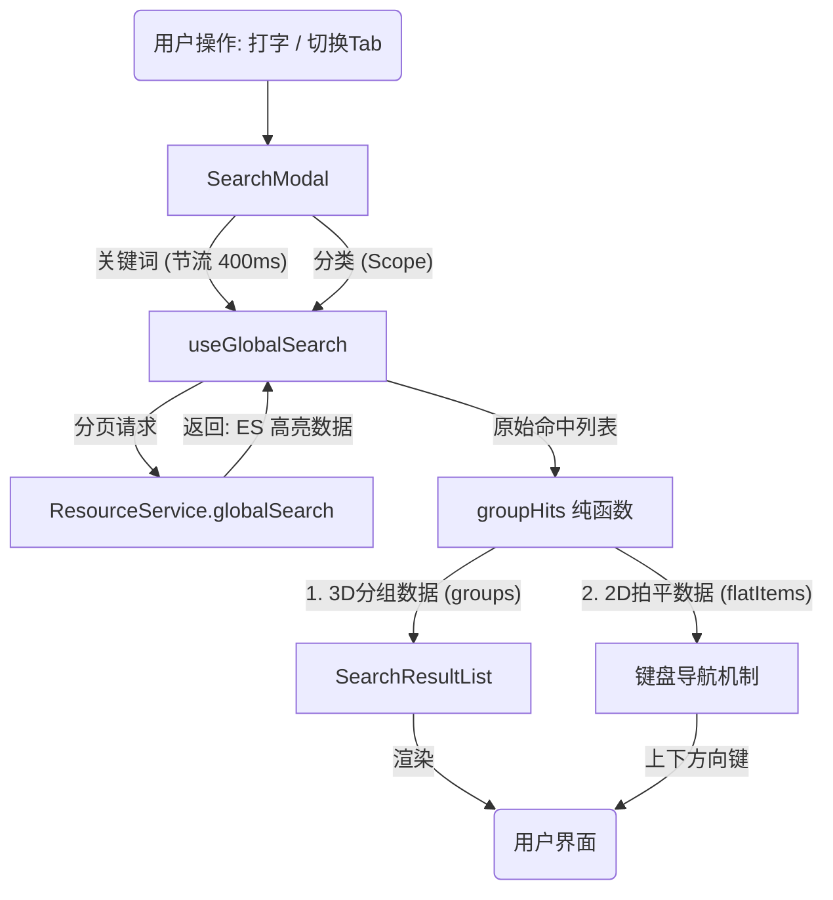

# 全局全文搜索组件与服务层重构需求

作为高级前端研发工程师，请帮我完成“全局搜索”功能的彻底重构。

## 1. 架构变动背景
后端的“搜索微服务”现已合并至“资源微服务（Resource Service）”。
因此，前端原有的独立 `SearchServices` 链路将全部废弃。新的全局搜索必须通过调用 **`ResourceServices`** 来实现。

## 2. 请先读取以下文件作为上下文（Context）
在开始编写代码前，请务必先读取并分析以下现有的绝对路径项目文件，了解当前的架构、依赖注入方式以及旧版组件的高亮和防抖逻辑：

*   **注入层**：`D:/大二下/softwareengineeeing/WisePenView/src/contexts/ServicesContext/registry.types.ts` (确认当前 Context 的结构)
*   **服务层 (Type)**：`D:/大二下/softwareengineeeing/WisePenView/src/services/Resource/index.type.ts` (了解现有的资源服务接口定义)
*   **服务层 (Impl)**：`D:/大二下/softwareengineeeing/WisePenView/src/services/Resource/ResourceServices.impl.ts` (了解现有的 Axios 请求封装方式)
*   **组件层 (旧版 UI)**：`D:/大二下/softwareengineeeing/WisePenView/src/components/Common/GlobalSearchBox/index.tsx` (重点提取现有的 400ms 防抖逻辑、路由跳转逻辑，以及基于 `dangerouslySetInnerHTML` 和 `.wp-highlight` 的渲染逻辑)

---

## 3. 具体重构任务与需求

### 任务 1：服务层 (Service API) 迁移
1.  **扩展 IResourceService**：在 `Resource/index.type.ts` 中新增 `SearchQueryReqDTO`（包含 `keyword`, `page`, `limit` 参数）。新增 `globalSearch` 方法签名。
2.  **实现接口**：在 `ResourceServices.impl.ts` 中实现该方法，对接后端的全局搜索接口。
3.  **清理旧依赖**：组件层后续将统一使用 `const { resourceService } = useService();`。

### 任务 2：UI 组件层 (`GlobalSearchBox/index.tsx`) 彻底重构
请将旧版的 `Popover` 替换为全屏居中的 Modal 模态框，UI 视觉风格参考 Algolia DocSearch。

**2.1 入口与唤起逻辑**
*   默认在页面挂载处只渲染一个“放大镜 🔍 图标”（带 `Ctrl+K` / `Cmd+K` 快捷键提示）。
*   点击图标或按快捷键，唤起带半透明遮罩的全屏 Modal。

**2.2 核心：三大 Tab 与分组逻辑 (Grouping)**
模态框内输入框下方必须有 3 个可切换的 Tab：「全部」、「文档」、「笔记」。
前端必须对后端返回的数据进行二次过滤和**分组（Group）展示**：
*   **「全部」Tab**：平铺展示，按具体的资源类型分组，分组 Header 显示 `PDF`、`Markdown`、`Note` 等。
*   **「文档」Tab**：前端过滤掉“笔记”数据，剩下的按文件后缀分组，Header 显示 `PDF`、`Markdown` 等。
*   **「笔记」Tab**：前端过滤掉“文档”数据，只展示笔记，Header 统一显示为 `Note`。

**2.3 交互体验与保留资产**
*   **无限滚动**：结果列表区域需设定 `max-height`，并支持下拉到底部触发下一页请求。
*   **键盘导航**：支持使用 `↑` `↓` 方向键跨越分组顺滑切换 `Active` 选中项，`Enter` 触发跳转，`Esc` 关闭。
*   **防抖与高亮**：**必须保留**读取到的旧代码中的 400ms 防抖逻辑；**必须保留**使用 `dangerouslySetInnerHTML` 渲染以支持红色高亮类名 `.wp-highlight`。

## 4. 输出要求
请直接为我输出修改后的完整代码，代码应具备高可读性：
1. `D:/大二下/softwareengineeeing/WisePenView/src/services/Resource/index.type.ts` 的增量修改。
2. `D:/大二下/softwareengineeeing/WisePenView/src/services/Resource/ResourceServices.impl.ts` 的增量修改。
3. `D:/大二下/softwareengineeeing/WisePenView/src/components/Common/GlobalSearchBox/index.tsx` (完整重写代码，注意 Hooks 拆分)。
4. `D:/大二下/softwareengineeeing/WisePenView/src/components/Common/GlobalSearchBox/style.module.less` (全新的 Algolia 风格样式)。


这是一份为你量身定制的 **README 文档**。

这份文档不仅解释了代码“是什么”，更记录了当时设计的“为什么（核心决策）”。你可以直接将这篇文档保存为 `src/components/Common/GlobalSearchBox/README.md`，它将成为后来接手这段代码的同事（或是几个月后的你自己）最好的导航地图。

***

# 🔍 全局全文搜索组件 (Global Search Box)

## 1. 📖 简介

本组件是系统级的**全局全文搜索模块**。
UI 交互与视觉规范全面对标 **Algolia DocSearch** / **Mac Spotlight**，为用户提供沉浸式、极速的搜索体验。

> **架构变更注记**：
> 本组件的底层数据源已完成架构迁移。原独立的 `SearchService` 已废弃，现已全量接入并入 `ResourceService` 的 `POST /search/global` 接口。

## 2. ✨ 核心特性

*   ⌨️ **全键盘驱动**：支持全局 `Cmd+K` / `Ctrl+K` 唤起。在结果列表中支持 `↑` `↓` 方向键跨分组平滑切换选中项，`Enter` 键直接打开预览，`Esc` 键关闭弹窗。
*   ⚡️ **极致性能防抖**：内置 400ms 输入节流（Debounce），有效拦截无效的频繁请求，保护后端 ES 引擎。
*   📜 **无限滚动分页**：剥离传统的分页器，基于 `IntersectionObserver` 实现下拉触底无感自动加载下一页。
*   🗂️ **智能分类与分组**：支持按「全部 / 文档 / 笔记」三大 Tab 进行大类过滤；并在结果列表中基于文件类型（PDF/Word/Note 等）进行视觉分组与粘性吸顶（Sticky Header）。
*   🖍️ **原生 ES 高亮解析**：安全解析并注入后端 Elasticsearch 返回的 `<em class="wp-highlight">` 标签，实现精准的红字高亮。

---

## 3. 📂 目录结构与职责

本模块遵循 **“UI 视图、状态钩子、数据处理分离”** 的原则，文件职责如下：

```text
GlobalSearchBox/
├── README.md                 # 本说明文档
├── index.tsx                 # 🚪 模块大门：暴露 🔍触发器按钮 及 监听全局快捷键
├── index.type.ts             # 📄 类型定义：内部 Props 定义
├── SearchModal.tsx           # 🏢 模态大楼：集成 Input输入框、Segmented切换栏 的外壳
├── SearchResultList.tsx      # 📺 放映室：核心 UI 列表，处理 DOM渲染、骨架屏、状态机
├── style.module.less         # 🎨 室内精装：Algolia 风格 CSS、原生自定义滚动条、高亮样式
├── hooks/
│   ├── useGlobalSearch.ts    # ⚙️ 引擎 Hook：基于 ahooks 封装，处理请求、防抖、累加分页
│   └── useKeyboardNav.ts     # 🕹️ 遥控器 Hook：(如分离) 专门处理键盘上下键的越界保护与回车逻辑
└── groupHits.ts              # 🧮 分拣中心：纯函数，负责数据的防错过滤、分类打包与拍平
```

---

## 4. 🔄 数据流与架构图

组件内部的数据流向为单向数据流，不依赖全局 Redux/Zustand 状态，实现**即插即用、即用即毁**：



---

## 5. 🧠 核心技术决策 (Tech Decisions)

为了实现大厂级的丝滑体验，我们在代码中埋入了一些高级工程化决策，维护时请务必注意：

1.  **“双重视角”处理数据 (Group vs Flat)**
    *   UI 渲染需要的是“带有分类标题的分层结构”（`groups`）。
    *   但键盘 `↑` `↓` 移动需要的是“绝对下标连续的数组”（`flatItems`）。
    *   我们在 `groupHits.ts` 中同时产出了这两种结构，实现了视觉上的隔离分组与键盘上的无缝穿梭。
2.  **极端场景的截断保护 (Clamped Active)**
    *   当用户输入新词导致搜索结果从 50 条锐减至 2 条时，原先键盘焦点的 `activeIndex` 可能会引发数组越界导致白屏崩溃。
    *   代码中采用了 `Math.min(activeIndex, flatItems.length - 1)` 强制截断，形成坚不可摧的安全网。
3.  **巧妙的生命周期控制 (`destroyOnHidden`)**
    *   模态弹窗使用了 Antd 的 `destroyOnHidden` 属性。弹窗一旦关闭，所有内部状态（搜索词、分页数据）将**直接从内存中被物理销毁**。这避免了手动清理状态的复杂冗余代码，确保每次 `Cmd+K` 唤起的都是一个干净的组件。
4.  **智能镜头跟随 (`scrollIntoView`)**
    *   配合无缝键盘导航，当选中的焦点移出可视区域时，代码通过 `row?.scrollIntoView({ block: 'nearest' })` 让列表滚动条自动平滑跟随焦点，体验极佳。

---

## 6. 🛠 后续维护指南

*   **Q: 如何修改全局搜索的触发快捷键？**
    A: 在 `index.tsx` 中修改 `useKeyPress(['ctrl.k', 'meta.k'])` 的按键绑定，并同步更新下方 `Tooltip` 中的文案逻辑。
*   **Q: 后端新增了文件类型（如 `.ppt`），列表里的分组标题显示不友好怎么办？**
    A: 打开 `groupHits.ts`，在顶部的 `TYPE_LABELS` 字典中追加对应的映射（如 `ppt: 'PowerPoint'`）即可。
*   **Q: 为什么搜出来的高亮文字没有变红？**
    A: 请检查后端返回的 HTML 标签是否被破坏，并确认 `style.module.less` 中关于 `:global(.wp-highlight)` 的样式声明没有被覆盖。

---
*Created with ❤️ for a better User Experience.*